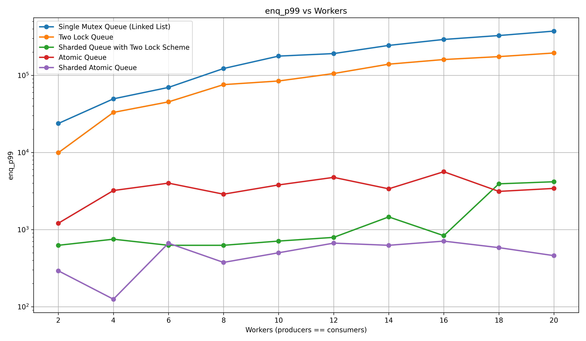
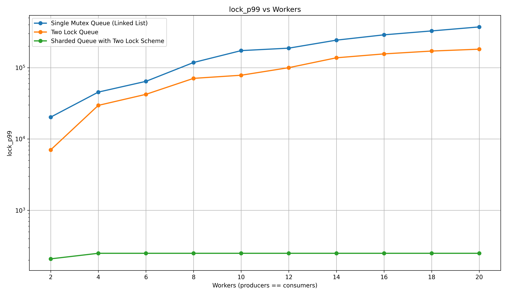
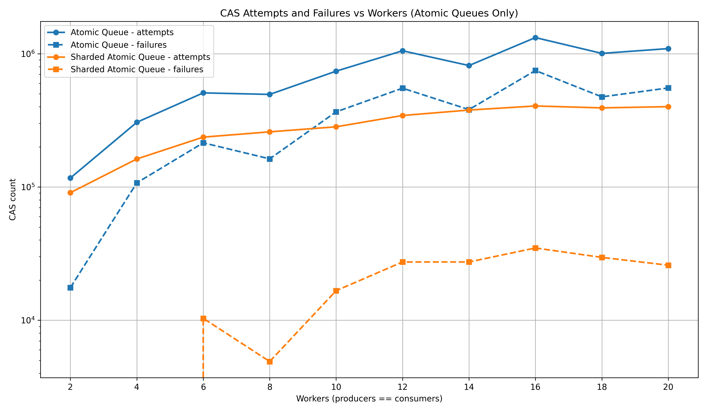
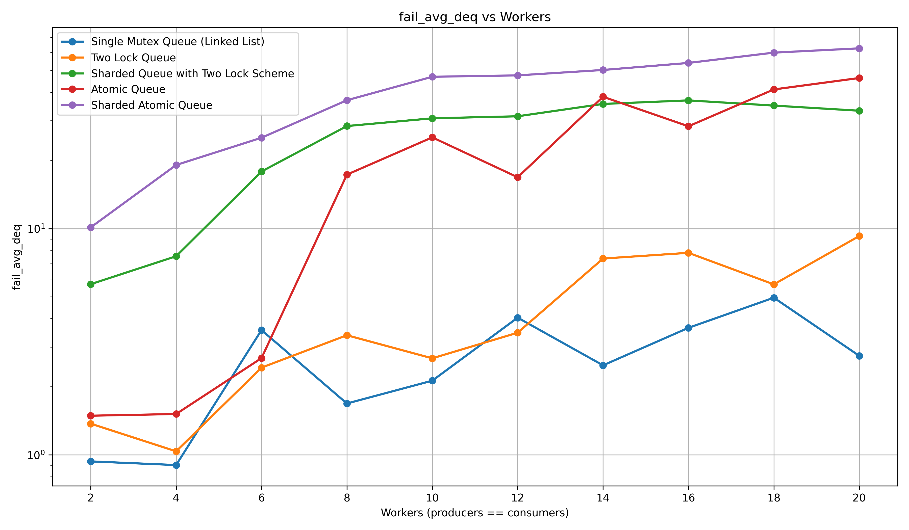
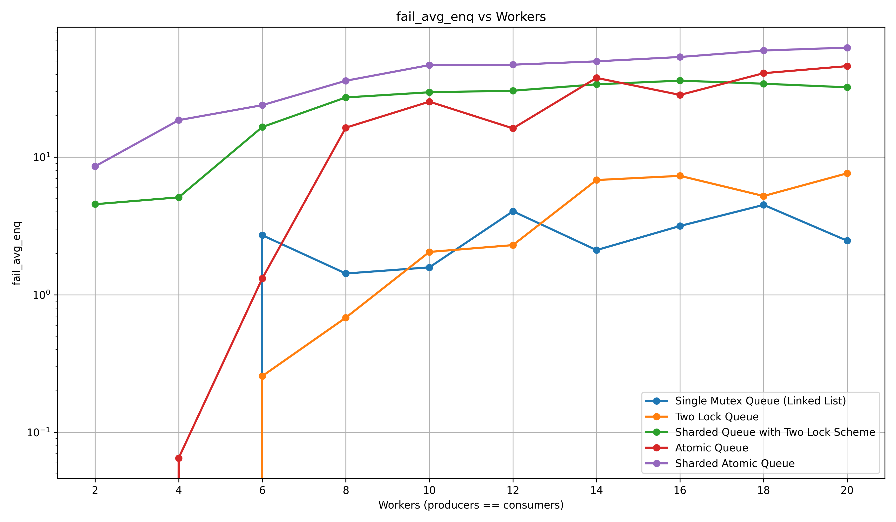

# Evolution of Concurrent Message Queues
## From Global Locking to Sharded Lock Free Designs

## Table of Contents
- [Evolution of Concurrent Message Queues](#evolution-of-concurrent-message-queues)
  - [From Global Locking to Sharded Lock Free Designs](#from-global-locking-to-sharded-lock-free-designs)
  - [Table of Contents](#table-of-contents)
  - [1. Intro and Mandate](#1-intro-and-mandate)
  - [2. Directory Structure](#2-directory-structure)
  - [3. What We Measure Is What We Understand](#3-what-we-measure-is-what-we-understand)
  - [4. Queuing Strategies](#4-queuing-strategies)
    - [4.1 Baseline: Single Global Lock](#41-baseline-single-global-lock)
    - [4.2 Splitting Contention: Two Lock Queue](#42-splitting-contention-two-lock-queue)
    - [4.3 Horizontal Scaling: Sharded Two Lock Queue](#43-horizontal-scaling-sharded-two-lock-queue)
    - [4.4 Removing Locks: Atomic MPMC Queue](#44-removing-locks-atomic-mpmc-queue)
    - [4.5 Best of Both Worlds: Sharded Atomic Queue](#45-best-of-both-worlds-sharded-atomic-queue)
  - [5. Experiment Design](#5-experiment-design)
    - [Workload Structure](#workload-structure)
    - [Execution Flow Per Run](#execution-flow-per-run)
    - [What Gets Recorded](#what-gets-recorded)
  - [6. Results and Interpretation](#6-results-and-interpretation)
    - [6.1 Enqueue p99 Latency](#61-enqueue-p99-latency)
    - [6.2 Lock Wait p99 (Locked Queues Only)](#62-lock-wait-p99-locked-queues-only)
    - [6.3 CAS Attempts and Failures (Atomic Queues Only)](#63-cas-attempts-and-failures-atomic-queues-only)
    - [6.4 Failure Rates: Enqueue and Dequeue](#64-failure-rates-enqueue-and-dequeue)
  - [7. Takeaways](#7-takeaways)


## 1. Intro and Mandate

The project explores how a simple multi producer multi consumer queue scales as we progressively remove contention. The mandate was straightforward: begin with a single global lock queue, identify its bottlenecks, and evolve the design through increasingly concurrent variants. Each step had to demonstrate correctness under MPMC workloads and be backed by real measurements instead of hand waving.

Message queues of this form sit on the hot path in storage engines, telemetry pipelines and any system that needs predictable handoff between threads. Small design flaws here ripple outward as latency spikes and/or tail-heavy distributions. This study shows what actually happens as you trade locks for atomics, or a single queue for many shards, and how those choices reshape the contention profile.

The report is organized as a progression: each design fixes one specific bottleneck in the previous one. All conclusions come directly from instrumented runs of the same workload using the same harness, ensuring that comparisons are strict apples to apples rather than intuition.


## 2. Directory Structure

```

lockedQueues/
│
├── main.cpp                  
├── README.md                 # This report
├── runExp.py                 
│
├── plots/                    
│
├── queues/                   
│   ├── msgQueueAtomic.h          
│   ├── msgQueueAtomicSharded.h   
│   ├── msgQueueMutex.h           
│   ├── msgQueueSharded.h         
│   ├── msgQueueTwoLock.h         
│   └── slot.h                    
│
└── utils/                    
├── metrics.h             
├── StatsSummary.h        
└── StressHarness.h       

```

## 3. What We Measure Is What We Understand

The measurements discussed below are the lens through which the design differences become obvious. Without them, every queue looks similar; with them, every bottleneck is unmistakable.

- **Enqueue Latency**  
  Time from entering `enqueue` to returning. It shows how much delay a producer runs into per operation. If this number climbs, something in the design is slowing producers down.

- **Dequeue Latency**  
  Same idea for consumers. A queue that is easy to push into but slow to pull from is not balanced, and the numbers make that visible.

- **Lock Wait Time**  
  Time spent stuck trying to acquire a lock. This is the clearest indicator of contention. If this grows, the design is effectively serial no matter how elegant it looks on paper.

- **Critical Section Duration**  
  Time actually spent inside the lock once it is acquired. Short critical sections mean the lock is not the limiting factor; long ones mean the work inside the lock is too heavy.

- **CAS Attempts**  
  How many times the algorithm tries to update shared state using atomics. High attempts signal threads repeatedly bumping into each other.

- **CAS Failures**  
  Each failure is a wasted attempt. When these rise, it means many threads are trying to make progress at the same time and blocking each other indirectly.

- **Failed Enqueues / Failed Dequeues**  
  These aren’t errors but indicators of pressure. Failed enqueues mean the queue felt full; failed dequeues mean consumers arrived when nothing was available. A good design would minimize these under load.


## 4. Queuing Strategies

### 4.1 Baseline: Single Global Lock  
The simplest design: one queue, one mutex, everyone stands in the same line. The metrics make the weakness obvious. Lock wait time dominates enqueue and dequeue latency because every producer and consumer must acquire the same lock for every operation. Critical sections stay small, but it doesn’t matter; the bottleneck is that only one thread can make progress at a time. This design gives us a reference point, but under load it collapses into serial execution. The next step is clear: break the monopoly on the lock.

---

### 4.2 Splitting Contention: Two Lock Queue  
The first evolution is splitting the queue’s hot spots. One lock guards enqueues, one lock guards dequeues. The effect is visible immediately in the metrics: lock wait time drops for both sides, and latency becomes less spiky. Producers no longer slow consumers and vice versa. But the ceiling is still low. All producers share the same enqueue lock; all consumers share the same dequeue lock. As thread count rises, contention piles up again. Splitting the lock helped, but only once. To go further, we need to stop forcing everyone into the same structure.

---

### 4.3 Horizontal Scaling: Sharded Two Lock Queue  
The next logical step is multiplication. Instead of one two-lock queue, we create several. Every thread is mapped to a shard, which means fewer threads per lock and shorter wait times. The metrics prove it: enqueue and dequeue latency shrink, lock wait becomes almost negligible, and failure rates fall because each queue is less pressurized. This is the first design that feels “parallel” instead of “less serialized.” But the queue still uses locks, and even tiny lock contention becomes visible when scaled further. To break past this point, we need to remove locks entirely.

---

### 4.4 Removing Locks: Atomic MPMC Queue  
The lock-free variant removes mutexes and replaces them with atomic operations. It looks ideal on paper, but the metrics remind us of reality. CAS attempts shoot up, CAS failures pile on, and retry counts spike because every thread competes to update the same atomic head and tail. Enqueue and dequeue latency improve compared to the earlier locked queues, but the design hits a different wall: too many threads fighting over the same atomic state. The lesson is simple: going lock free doesn’t fix contention, it just moves it. The only way forward is to combine the strengths of sharding with the strengths of the atomic design.

---

### 4.5 Best of Both Worlds: Sharded Atomic Queue  
Here the story converges. We shard the atomic queue the same way we sharded the two-lock queue. Suddenly contention is no longer global; CAS attempts and failures plummet because each shard has its own head and tail. Latency drops into the sub-microsecond range, tail latencies flatten, and failure rates nearly vanish. This is where the trends from all earlier metrics finally align: low lock wait, low retry counts, low contention pressure, and minimal interference between workers. At this point, further gains would require entirely different techniques; the simple queue structure has reached its practical ceiling.

## 5. Experiment Design

The experiment loop is simple on the surface but very strict in how it collects data. Every queue is subjected to the exact same workload, driven by the same harness, and measured through the same instrumentation layer. Nothing is hand-timed; everything flows through code paths that guarantee comparable stats across implementations.

### Workload Structure
- A fixed number of producers and consumers are created for each run.  
- Each producer pushes `msgs_per_producer` messages; consumers collectively pull the same total count.  
- The harness repeats this entire cycle `num_runs` times to smooth out jitter and warmup effects.  
- Every producer and consumer thread is given a dedicated `ThreadMetrics` slot so metric collection never contends.  
  (All of this is implemented in `StressHarness.h`.)

### Execution Flow Per Run
- `spawn_consumers()` starts all consumer threads, each repeatedly calling `q.dequeue(...)` and recording latency, success, and failure.  
- `spawn_producers()` then starts all producer threads, each repeatedly calling `q.enqueue(...)` with the same metrics collection.  
- All threads run to completion and are joined.  
- The harness merges all per-thread metrics into a single `final_metrics` object using `appendFrom()` from `ThreadMetrics`.

### What Gets Recorded
Instrumentation hooks capture:
- enqueue and dequeue latency per operation  
- whether the operation succeeded or failed  
- lock wait times and critical section durations (for lock-based queues)  
- CAS attempts, failures, and retry counts (for atomic queues)

All of these measurements are pushed into per-thread vectors, later aggregated and summarized through `computeStats()` in `StatsSummary.h` :contentReference[oaicite:2]{index=2}, and finally written to `results.csv`.

The outcome is a dataset where every queue has been driven through the same mechanical pipeline, allowing direct apples-to-apples comparisons across all strategies.


## 6. Results and Interpretation

Summary: The Essential Plot Set
Enqueue latency p95 / p99
Lock wait (avg/p95)
CAS attempts vs failures
Failure rates (enq/deq)

### 6.1 Enqueue p99 Latency



This plot shows how each queue design behaves under pressure when we look at the 99th percentile enqueue latency — the point where contention, retries, and structural bottlenecks show themselves most clearly.

- **Single Global Lock**  
  The curve climbs almost monotonically. Every producer must take the same lock for every operation, so p99 reflects nothing but threads waiting their turn. As workers increase, the queue behaves more like a one-lane toll booth.

- **Two Lock Queue**  
  Splitting head and tail helps, but not enough. All producers still serialize on the same enqueue lock, so p99 grows quickly and stays high. Better than the global lock, but still structurally bottlenecked.

- **Sharded Two Lock Queue**  
  Latency drops by nearly an order of magnitude because each shard has independent locks. The bumps at worker counts like 6 and 18 come from uneven shard mapping: if multiple producers land on the same shard modulo, that shard’s locks see temporary pressure.

- **Atomic Queue (Unsharded)**  
  Lower than both locked designs, but unstable. Peaks appear at certain worker counts where many producers collide on the same atomic tail position, causing CAS retry storms. No mutex, but still one shared tail.

- **Sharded Atomic Queue**  
  This is the only curve that stays low and flat across the full range. With each shard maintaining its own atomic head and tail, retry storms never build long enough to distort p99. This is the cleanest, calmest enqueue path under load.

In short, enqueue p99 cleanly exposes the progression of this study:  
global lock → less contention → sharded structures → sharded atomics as the final steady state.


### 6.2 Lock Wait p99 (Locked Queues Only)



This plot isolates the lock-based designs and shows how long threads spend *waiting* to acquire a lock at the 99th percentile. It is the most direct way to see which queues are actually scaling and which are just pretending to.

- **Single Global Lock**  
  The p99 lock wait rises sharply with every increase in worker count. This is expected: all producers and consumers must acquire the same mutex, so wait chains lengthen as more threads pile up behind the same gate.

- **Two Lock Queue**  
  Cutting the queue into enqueue-side and dequeue-side locks reduces contention, so p99 drops across the entire range. But both locks are still shared resources, and the curve keeps climbing. Producers fight with producers; consumers fight with consumers.

- **Sharded Two Lock Queue**  
  This is where the pattern breaks. The lock p99 stays almost flat and close to the floor, because each shard has its own pair of locks. Threads only wait behind the handful of workers mapped to their shard. The small bump around 18 workers reflects uneven shard distribution rather than fundamental limitation.

Lock p99 is the closest thing to an X-ray of contention:  
a single lock shows exponential pain, two locks show controlled but rising pressure, and sharding wipes the problem off the chart.

### 6.3 CAS Attempts and Failures (Atomic Queues Only)



This figure reveals how the two atomic queue designs behave when multiple workers try to advance shared atomic state. Since neither design uses locks, progress is governed entirely by whether competing CAS operations succeed or get forced into retry loops.

- **Atomic Queue (Unsharded)**  
  CAS attempts climb sharply with worker count because all producers compete for the same `tail` update and all consumers compete for the same `head` update.  
  Failures follow a similar shape, showing that many attempts lose the race and must retry. These retries inflate latency and make the design unpredictable under load.

- **Sharded Atomic Queue**  
  When we shard, each shard has its own head and tail, so far fewer workers collide on any given CAS target.  
  Attempts stay dramatically lower, and failures collapse by nearly an order of magnitude. The curve is smoother too, because per-shard pressure is stable and isolated.

CAS behavior is the most transparent indicator that “lock-free” does not mean “contention-free.”  
One atomic queue becomes a battlefield; several atomic queues become calm, predictable, and fast.

### 6.4 Failure Rates: Enqueue and Dequeue

  


These two figures highlight a dimension that latency alone cannot capture: how often operations fail because the queue is momentarily empty (for dequeues) or full (for enqueues). Even a fast queue can produce a lot of failures if the design applies pressure in the wrong places.

- **Single Global Lock and Two Lock Queue**  
  Failure rates start low but climb as workers increase. The pattern is uneven but predictable: high contention causes slow consumers and producers to fall out of sync, making empty or full conditions more common.

- **Sharded Two Lock Queue**  
  Sharding dramatically improves latency, but each shard is smaller. A smaller shard fills or empties faster, which shows up here as higher failure rates at larger worker counts. The queue is fast, but its capacity per shard becomes the limiting factor.

- **Atomic Queue (Unsharded)**  
  CAS retry storms cause bursts of delay, and when producers stall the queue can empty out for consumers. When consumers stall, the queue overfills. The failure pattern reflects these imbalances.

- **Sharded Atomic Queue**  
  This design has the lowest latency but the highest steady-state failure rates. The reason is structural: each shard is tiny, extremely fast, and frequently cycles between full and empty. The queue isn’t slowing down; it’s simply reaching its capacity limits far more often because it can drain or fill a shard almost instantly.

These plots serve as a reminder that low latency does not mean low pressure. A design can be extremely fast but still report a high number of failures if small per-shard queues are repeatedly driven empty or full under load.

In many real workloads, this isn’t catastrophic. If the overall termination condition is based on “run until work is genuinely finished” rather than “spin until success,” the overhead of a failure followed by a retry is negligible. Failures become just part of the pacing between producers and consumers rather than a meaningful cost.


## 7. Takeaways

- **Sharding wins.**  
  Smaller contention domains beat every other technique.

- **Lock-free isn’t magic.**  
  Unsharded atomics still fight over shared state.


- **Failures aren’t fatal.**  
  Fast shards hit empty/full states often, but retries cost little in real “run-to-completion” workloads.

A final caveat: sharding is not universally correct. Some workloads require strict ordering, global visibility, or coordinated access that makes sharded queues algorithmically invalid. In those cases, the gains shown here simply don’t apply.  
Examples include a strictly ordered log ingestion pipeline and a global job scheduler that must preserve FIFO semantics across workers.


